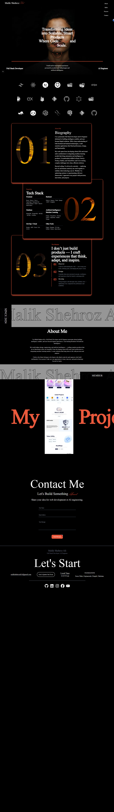

# <center style="font-size: 5rem; color:#ea593c">Malik Shehroz Ali</center>
# 🌟 Portfolio Website

A modern, responsive portfolio website showcasing my work, skills, and professional journey.



## ✨ Features

- **Responsive Design** - Seamlessly adapts to all device sizes
- **Modern UI/UX** - Clean, intuitive interface with smooth animations
- **Fast Performance** - Optimized for speed and user experience
- **SEO Optimized** - Built with search engine visibility in mind
- **Accessible** - Following WCAG guidelines for accessibility

## 🛠️ Built With

- **Frontend Framework** - Next.js
- **Styling** - Tailwind CSS
- **Animations** - Framer Motion, GSAP
- **Deployment** - Vercel, GitHub Pages

## 🚀 Getting Started

### Prerequisites

```bash
node >= 14.x
npm >= 6.x
```

### Installation

1. Clone the repository
```bash
git clone https://github.com/malikshehrozali/portfolio.git
```

2. Navigate to the project directory
```bash
cd portfolio
```

3. Install dependencies
```bash
npm install
```

4. Start the development server
```bash
npm run dev
```

5. Open your browser and visit `http://localhost:3000`

## 📁 Project Structure

```
└── 📁src
    └── 📁app
        └── 📁api
            └── 📁contact
                ├── route.ts
        ├── favicon.ico
        ├── globals.css
        ├── layout.tsx
        ├── page.tsx
    └── 📁components
        ├── ContactForm.tsx
        ├── Footer.tsx
        ├── Header.tsx
        ├── Hero.tsx
        ├── Logo.tsx
        ├── LoopOnScroll.tsx
        ├── PageTransition.tsx
        ├── PakistansTime.tsx
        ├── ScrollDownButton.tsx
        ├── Scroller.tsx
        ├── ServerForm.tsx
    └── 📁fonts
        ├── MonsieurLaDoulaise-Regular.ttf
        ├── times.ttf
    └── 📁pages
        ├── About.tsx
        ├── Contact.tsx
        ├── Projects.tsx
        └── Skills.tsx
```

## 🎨 Customization

### Updating Content

Edit the data files in `src/data/` to update:
- Personal information
- Project showcases
- Skills and technologies
- Contact information

### Styling

Customize the theme by modifying the variables in your style configuration file.

## 📫 Contact

Feel free to reach out for collaborations or opportunities!

- **Email** - malikshehrozali16@gmail.com
- **LinkedIn** - [Your LinkedIn](https://linkedin.com/in/malikshehrozali)
- **Twitter** - [@maliksherozali](https://twitter.com/MalikSherozAli)
- **Portfolio** - [yourwebsite.com](https://yourwebsite.com)

## 📄 License

This project is licensed under the MIT License - see the [LICENSE](LICENSE) file for details.

## 🙏 Acknowledgments

- Design inspiration from [sources]
- Icons from [icon library]
- Fonts from [font source]

---

<div align="center">
  <sub>Built with ❤️ by Malik Shehroz Ali</sub>
</div># portfolio
